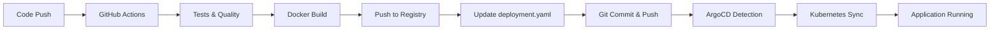

# ArgoCD GitOps Guide

Tento návod popisuje, jak ArgoCD automaticky provádí release a deployment aplikace pomocí GitOps principů.

## Přehled ArgoCD GitOps

ArgoCD je Kubernetes-native continuous deployment nástroj, který implementuje GitOps workflow. Sleduje Git repository a automaticky synchronizuje stav aplikace v Kubernetes clusteru podle definice v Git.

### Základní principy GitOps:
- **Git jako jediný zdroj pravdy** (Single Source of Truth)
- **Deklarativní konfigurace** v YAML manifestech
- **Automatická synchronizace** Git → Kubernetes
- **Continuous monitoring** a self-healing

## Konfigurace ArgoCD aplikace

### Aktuální konfigurace (`k8s/argocd-application.yaml`):
```yaml
apiVersion: argoproj.io/v1alpha1
kind: Application
metadata:
  name: k8sapp
  namespace: argocd
spec:
  project: default
  source:
    repoURL: 'https://github.com/mafin/k8sapp.git'
    path: k8s
    targetRevision: HEAD
  destination:
    server: 'https://kubernetes.default.svc'
    namespace: k8sapp
  syncPolicy:
    automated:
      prune: true
      selfHeal: true
    syncOptions:
      - CreateNamespace=true
```

### Vysvětlení konfigurace:

#### Source (Zdroj):
- **`repoURL`**: GitHub repository URL
- **`path: k8s`**: Sleduje pouze `k8s/` adresář
- **`targetRevision: HEAD`**: Sleduje aktuální `master` branch

#### Destination (Cíl):
- **`server`**: Kubernetes cluster (aktuální cluster)
- **`namespace: k8sapp`**: Target namespace pro deployment

#### Sync Policy (Automatizace):
- **`automated`**: Povoluje automatický sync
- **`prune: true`**: Smaže resources, které už nejsou v Git
- **`selfHeal: true`**: Opraví manuální změny zpět na Git stav
- **`CreateNamespace=true`**: Automaticky vytvoří namespace

## Jak ArgoCD detekuje změny

### 1. Polling mechanismus
```bash
# ArgoCD kontroluje Git repository každé ~3 minuty (default)
# Konfigurovatelné v ArgoCD settings:
timeout.reconciliation: 180s
```

### 2. Webhook trigger (doporučeno)
Pro okamžité reakce na Git push:

#### GitHub webhook konfigurace:
1. **GitHub Repository** → **Settings** → **Webhooks**
2. **Add webhook**:
   - **Payload URL:** `https://<your-argocd-server>/api/webhook`
   - **Content type:** `application/json`
   - **Secret:** (volitelné, ale doporučené)
   - **Events:** `Just the push event`
   - **Active:** ✅

#### ArgoCD webhook secret (volitelné):
```bash
kubectl create secret generic argocd-webhook-secret \
  --from-literal=webhook.github.secret=<your-webhook-secret> \
  -n argocd
```

### 3. Image tag tracking

**Problém s `latest` tagem:**
ArgoCD nedetekuje změny v `latest` tagu, protože YAML manifest zůstává stejný.

**Řešení - Versioned tags:**
```yaml
# V deployment.yaml používejte specific tagy:
spec:
  template:
    spec:
      containers:
      - name: k8sapp
        image: registry.digitalocean.com/mafin-dev/k8sapp:v1.5
        # ArgoCD detekuje změny při změně tagu v Git
```

**Automatické tagging v CI/CD:**
```yaml
# GitHub Actions vytváří multiple tags:
tags: |
  registry.digitalocean.com/mafin-dev/k8sapp:latest
  registry.digitalocean.com/mafin-dev/k8sapp:v1.${{ github.run_number }}
  registry.digitalocean.com/mafin-dev/k8sapp:${{ github.sha }}
```

## Release proces

### Kompletní release workflow:



**Důležité:** GitHub Actions teď automaticky aktualizuje `k8s/deployment.yaml` s novým image tagem **až po** úspěšném push do registry. To eliminuje race condition kdy ArgoCD detekuje změny dříve než je image dostupný.

### 1. Code změny → Git push
```bash
git add .
git commit -m "feat: add new feature"
git push origin master
```

### 2. GitHub Actions CI/CD
- ✅ Testy, PHPStan, CS Fixer
- ✅ Docker build
- ✅ Push do DigitalOcean Registry
- ✅ **Automatická aktualizace** `k8s/deployment.yaml` s novým tagem
- ✅ **Git commit & push** změny zpět do repository

### 3. ArgoCD detekce a sync
1. **Detection**: ArgoCD zjistí změny v Git
2. **Diff calculation**: Porovná aktuální vs desired stav
3. **Sync execution**: Aplikuje změny do K8s
4. **Health check**: Ověří health nových podů

### 4. Co spustí release:

#### Změny YAML manifestů:
- ✅ **`k8s/deployment.yaml`** → Rolling update podů
- ✅ **`k8s/service.yaml`** → Update služeb
- ✅ **`k8s/ingress.yaml`** → Routing changes
- ✅ **`k8s/configmap.yaml`** → Config updates
- ✅ **Nové manifesty** → Vytvoření nových resources

#### Změny Docker image:
- ✅ **Nový tag** → Image pull a restart
- ✅ **Latest tag update** → ArgoCD detekuje hash změnu

#### Změny konfigurace:
- ✅ **Environment variables**
- ✅ **Resource limits**
- ✅ **Replica count**

## Monitoring a management

### 1. Kontrola stavu přes kubectl
```bash
# Stav ArgoCD aplikace
kubectl get applications -n argocd

# Detailní informace
kubectl describe application k8sapp -n argocd

# Události a logy
kubectl get events -n argocd --sort-by=.metadata.creationTimestamp
kubectl logs -n argocd deployment/argocd-application-controller
```

### 2. ArgoCD UI
```bash
# Port-forward pro přístup k UI
kubectl port-forward svc/argocd-server -n argocd 8080:443

# Přístup: https://localhost:8080
# Login: admin / <admin-password>
```

#### UI features:
- **Application overview**: Zdraví a sync status
- **Resource tree**: Vizualizace všech K8s resources
- **Sync history**: Historie všech deploymentů
- **Live diff**: Real-time rozdíly Git vs K8s
- **Manual sync**: Možnost ručního sync

### 3. ArgoCD CLI
```bash
# Instalace ArgoCD CLI
curl -sSL -o argocd-linux-amd64 https://github.com/argoproj/argo-cd/releases/latest/download/argocd-linux-amd64
sudo install -m 555 argocd-linux-amd64 /usr/local/bin/argocd

# Login
argocd login <argocd-server>

# Užitečné příkazy
argocd app list
argocd app get k8sapp
argocd app sync k8sapp
argocd app history k8sapp
```

## Troubleshooting

### 1. Aplikace není synchronized
```bash
# Zkontrolujte stav
kubectl get application k8sapp -n argocd -o yaml

# Možné příčiny:
# - Chybný Git URL nebo branch
# - Neplatné YAML manifesty
# - Chybějící RBAC permissions
# - Network connectivity issues
```

### 2. Sync selhává
```bash
# Logy ArgoCD controlleru
kubectl logs -n argocd deployment/argocd-application-controller

# Events
kubectl get events -n argocd
kubectl get events -n k8sapp
```

### 3. Zdravotní problémy aplikace
```bash
# Kontrola health status
argocd app get k8sapp --show-params

# Refresh aplikace
argocd app get k8sapp --refresh

# Hard refresh (force re-sync)
argocd app sync k8sapp --force
```

### 4. Webhook nefunguje
```bash
# Test webhook
curl -X POST https://<argocd-server>/api/webhook \
  -H "Content-Type: application/json" \
  -d '{"ref":"refs/heads/master"}'

# Zkontrolujte webhook logy
kubectl logs -n argocd deployment/argocd-server | grep webhook
```

### 5. ArgoCD ukazuje "Synced" ale není nasazená nejnovější verze
```bash
# Problém: ArgoCD ukazuje Synced, ale Last Sync je starší než nejnovější commit

# 1. Zjistěte aktuální commit v ArgoCD
kubectl describe application k8sapp -n argocd | grep -E "(Revision|Target)"

# 2. Zjistěte aktuální image v deploymentu
kubectl get deployment k8sapp-deployment -n k8sapp -o jsonpath='{.spec.template.spec.containers[0].image}'

# 3. Porovnejte s nejnovějším image tagom z GitHub Actions
# Zkontrolujte GitHub Actions runs a najděte nejnovější run number

# 4. Force refresh ArgoCD
kubectl patch application k8sapp -n argocd --type merge --patch='{"metadata": {"annotations": {"argocd.argoproj.io/refresh": "hard"}}}'

# 5. Manual sync pokud potřeba
kubectl patch application k8sapp -n argocd --type merge --patch='{"operation": {"sync": {"syncStrategy": {"apply": {"force": true}}}}}'

# Řešení: Používejte specific image tagy místo 'latest'
# Latest tag může být problematický - ArgoCD nedetekuje změny
```

### 6. Jak zjistit jaká verze je nasazená
```bash
# 1. Zkontrolujte image tag v deploymentu
kubectl get deployment k8sapp-deployment -n k8sapp -o jsonpath='{.spec.template.spec.containers[0].image}'
# Výstup: registry.digitalocean.com/mafin-dev/k8sapp:v1.123

# 2. Porovnejte s nejnovějším GitHub Actions run
# GitHub Actions vytváří tagy ve formátu: v1.${{ github.run_number }}
# Run number 123 = v1.123 tag

# 3. Zkontrolujte commit hash
kubectl get deployment k8sapp-deployment -n k8sapp -o yaml | grep -A5 -B5 image:
# Pokud používáte SHA tag, můžete porovnat s Git commity

# 4. Alternativně přes ArgoCD UI
# Podívejte se na "Target Revision" vs "Last Sync" v ArgoCD UI
```

## Pokročilé konfigurace

### 1. Sync waves (postupný deployment)
```yaml
metadata:
  annotations:
    argocd.argoproj.io/sync-wave: "1"  # Deploy order
```

### 2. Health checks
```yaml
metadata:
  annotations:
    argocd.argoproj.io/health-check-timeout: "300"
```

### 3. Ignore differences
```yaml
spec:
  ignoreDifferences:
  - group: apps
    kind: Deployment
    jsonPointers:
    - /spec/replicas  # Ignorovat changes v replica count
```

### 4. Pre/Post sync hooks
```yaml
metadata:
  annotations:
    argocd.argoproj.io/hook: PreSync
    argocd.argoproj.io/hook-delete-policy: BeforeHookCreation
```

## Rollback strategie

### 1. Git-based rollback
```bash
# Rollback Git commit
git revert <commit-hash>
git push origin master

# ArgoCD automaticky aplikuje rollback
```

### 2. ArgoCD rollback
```bash
# Seznam verzí
argocd app history k8sapp

# Rollback na specifickou verzi
argocd app rollback k8sapp <revision-id>
```

### 3. Kubernetes rollback
```bash
# Kubernetes native rollback
kubectl rollout undo deployment/k8sapp-deployment -n k8sapp
# Poznámka: ArgoCD pak opět sync na Git stav (self-heal)
```

## Security best practices

### 1. RBAC konfigurace
```yaml
# ArgoCD AppProject s omezenými právy
apiVersion: argoproj.io/v1alpha1
kind: AppProject
metadata:
  name: k8sapp-project
  namespace: argocd
spec:
  sourceRepos:
  - 'https://github.com/mafin/k8sapp.git'
  destinations:
  - namespace: k8sapp
    server: https://kubernetes.default.svc
  clusterResourceWhitelist:
  - group: ""
    kind: Namespace
```

### 2. Image security
```yaml
# Použití specific tagů místo 'latest'
image: registry.digitalocean.com/mafin-dev/k8sapp:v1.2.3

# Image pull policy
imagePullPolicy: Always
```

### 3. Git repository security
- ✅ Private repository
- ✅ SSH keys nebo Personal Access Tokens
- ✅ Branch protection rules
- ✅ Required reviews

## Monitoring a metriky

### 1. ArgoCD metriky
```bash
# Prometheus metriky
kubectl port-forward svc/argocd-metrics -n argocd 8082:8082
curl http://localhost:8082/metrics
```

### 2. Application metriky
- **Sync frequency**: Jak často se aplikace synchronizuje
- **Health status**: Zdraví aplikace
- **Deployment time**: Doba deploymentu
- **Failure rate**: Míra selhání

### 3. Alerting
```yaml
# Příklad Prometheus alert rule
- alert: ArgoCDAppOutOfSync
  expr: argocd_app_sync_total{sync_status!="Synced"} > 0
  for: 5m
  labels:
    severity: warning
  annotations:
    summary: "ArgoCD application {{ $labels.name }} is out of sync"
```

## Příklady workflow

### 1. Standardní feature release
```bash
# 1. Development
git checkout -b feature/new-endpoint
# ... coding ...
git commit -m "feat: add new API endpoint"
git push origin feature/new-endpoint

# 2. Pull Request & Review
# GitHub PR → Review → Merge to master

# 3. Automatic deployment
# GitHub Actions → Docker build → Registry push
# ArgoCD detects → Kubernetes sync → Live!
```

### 2. Hotfix deployment
```bash
# 1. Urgent fix
git checkout -b hotfix/critical-bug
# ... fix ...
git commit -m "fix: resolve critical security issue"

# 2. Fast-track merge
git checkout master
git merge hotfix/critical-bug
git push origin master

# 3. Immediate deployment
# ArgoCD webhook → Instant sync → Fixed!
```

### 3. Configuration change
```bash
# 1. Update K8s manifest
vim k8s/deployment.yaml  # Změna env vars, resources, atd.
git commit -m "config: increase memory limits"
git push origin master

# 2. ArgoCD sync
# Config change → Rolling update → Applied!
```

## Závěr

ArgoCD poskytuje robustní GitOps platformu pro automatizované deployment do Kubernetes. Klíčové výhody:

- ✅ **Declarative**: Všechno definováno v Git
- ✅ **Automated**: Automatické sync a deployment
- ✅ **Auditable**: Kompletní historie změn
- ✅ **Recoverable**: Snadný rollback a disaster recovery
- ✅ **Secure**: RBAC, policy enforcement

Váš současný setup s automatickým sync, prune a self-heal je ideální pro production environment!

## Užitečné odkazy

- [ArgoCD dokumentace](https://argo-cd.readthedocs.io/)
- [GitOps principles](https://www.gitops.tech/)
- [ArgoCD best practices](https://argoproj.github.io/argo-cd/user-guide/best_practices/)
- [Kubernetes deployment strategies](https://kubernetes.io/docs/concepts/workloads/controllers/deployment/)